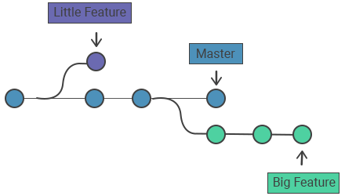

# Branch
If a [*repository*](./Repository.md) in Git can be thought of as a book, branches are its chapters. 
Branches in Git should be used to create different collections of ["*commits*"](./Commits.md) to tell a similar story. 
One example of this would be to create a branch for every major feature in a software development project.

## GitFlow Overview
* [Table of Contents](./README.MD)
* [Repository](./Repository.md)
* [Clone](./Clones.md)
* [Fork](./Forks.md)
* _**Branch**_
* [Commit](./Commits.md)
* [Merge](./Merges.md)
* [Checkout](./Checkout.md)
* [Push](./Push.md)
* [Pull](./Pull.md)
* [Remote Add / Remove / Show](./RemoteAddRemoveShow.md)
* [Status](./Status.md)
* [Master Branch](MasterBranch.md)