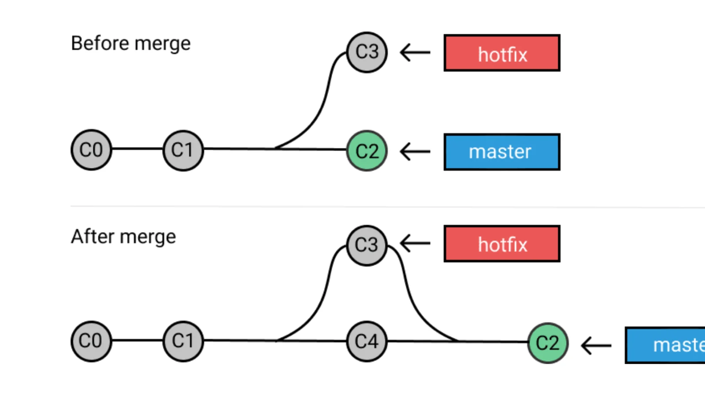

# Merge
The merge command is used to take changes from two separate [branches](./Branches.md) and combine them into one. 
This can be for combining several sub features and bug fixes into minor [branches](./Branches.md), or to combine whole branches into the master.
One would also merge remote changes into their local [repository](./Repository.md) to ensure they had the most up to date versions before starting anything new. 

## GitFlow Overview
* [Table of Contents](./README.MD)
* [Repository](./Repository.md)
* [Clone](./Clones.md)
* [Fork](./Forks.md)
* [Branch](./Branches.md)
* [Commit](./Commits.md)
* _**Merge**_
* [Checkout](./Checkout.md)
* [Push](./Push.md)
* [Pull](./Pull.md) 
* [Remote Add / Remove / Show](./RemoteAddRemoveShow.md)
* [Status](./Status.md)
* [Master Branch](MasterBranch.md)