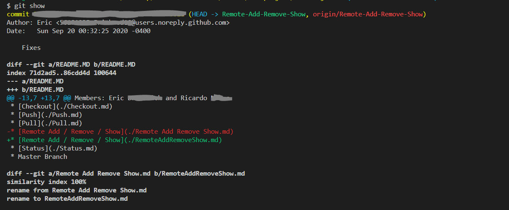

# Remote Add / Remove / Show

### Add
The Git Add command updates the index using the current content found in the working tree, to prepare the content for the next commit.With the help of this command, you tell Git that you want to add updates to a certain file in the next commit. But in order to record changes, you need to run git [commits](./Commits.md) as well.

### Remove
The Git Remove or "git rm" command removes files from the Git [repository](./Repository.md). It allows you to not only delete a file from the repository, but also if you wish from the filesystem. The main function of git rm is removing tracked files from the index. Its worth noting the git rm command does not remove branches. 

### Show
The Git Show command shows various types of objects for example blobs, trees, tags and commits. In the case of [commits](./Commits.md), it shows the log messge and textual diff. It also presents the merge commit in a special format generated by git.

## GitFlow Overview
* [Repository](./Repository.md)
* [Clone](./Clones.md)
* [Fork](./Forks.md)
* [Branch](./Branches.md)
* [Commit](./Commits.md)
* [Merge](./Merges.md)
* [Checkout](./Checkout.md)
* [Push](./Push.md)
* [Pull](./Pull.md) 
* _**Remote Add / Remove / Show**_
* [Status](./Status.md)
* Master Branch
