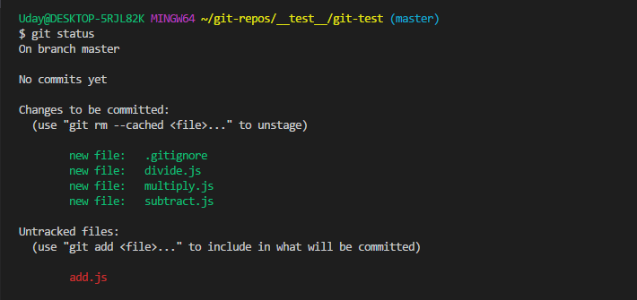

# Status
The git status command shows the states of the working directory and staging area. It lets you see which files are not being tracked by Git and lets you see which changes have and have not been staged. Basically it shows you what's been going on with git add amd git [commit](./Commits.md).

## GitFlow Overview
* [Table of Contents](./README.MD)
* [Repository](./Repository.md)
* [Clone](./Clones.md)
* [Fork](./Forks.md)
* [Branch](./Branches.md)
* [Commit](./Commits.md)
* [Merge](./Merges.md)
* [Checkout](./Checkout.md)
* [Push](./Push.md)
* [Pull](./Pull.md) 
* Remote Add / Remove / Show
* _**Status**_
* Master Branch
